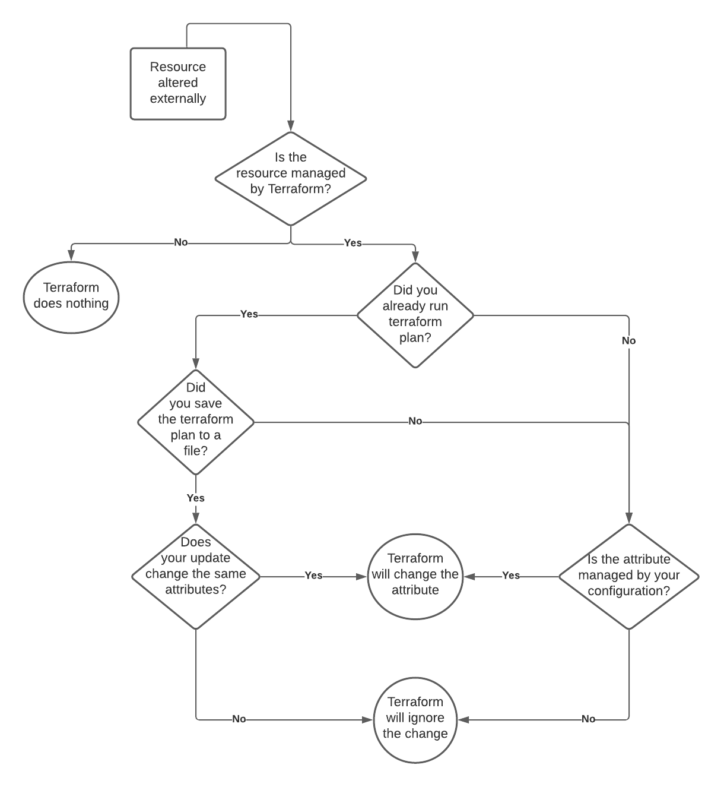

# Terraform Apply? When External Change Happens.

In an ideal world, all changes to your infrastructure would be managed through Terraform. In reality, that doesn't always happen. Which can leave you in a bit of a conundrum regarding your next `terraform apply`. What will happen to the changes made outside of Terraform? Does it matter whether you saved the last `terraform plan` output? Will Terraform even see the changes made to the infrastructure? Will it overwrite those changes? And what can you do to prevent future occurrences? I set out to discover these answers and more.

## Terraform Plan and Apply Basics

Before we go through the various scenarios out there, I first want to go back to basics and consider what Terraform is doing when it runs `plan` or `apply`. First we'll start with `plan`.

### Terraform Plan

Assuming you run `terraform plan` without any additional arguments, the Terraform executable is going to do the following:

* Look for state data
* Refresh the state data
* Compare the state data to the code
* Find necessary changes to make state data match the code
* Print the proposed changes out to the terminal window

Note the first two steps are to check for state data and refresh it. Terraform wants to work with the newest information available from the target environment. Each resource and data source has two unique attributes: the address used in the code and the unique ID in the target environment. For instance, an Amazon VPC might have the address `aws_vpc.my_vpc` in the Terraform code, and the unique ID of `vpc-12345` in AWS. The state
data is simply a mapping of the address to the unique ID, and a list of attributes associated with the resource at that unique ID. In the case of the VPC, the attributes would include things like the `cidr_block`, `owner_id`, and `main_route_table_id`. The full list of attributes for a given resource or data source can be found in the Terraform documentation.

Within your Terraform code, you can set some of the attribute values through arguments. The arguments can be *required* or *optional*, for instance the `cidr_block` argument is optional for a VPC. Any attributes that are managed by AWS are not available as arguments, the `owner_id` for example is not a value you can change.

Terraform `plan` first checks to see if the target resource exists, e.g. does the VPC `vpc-12345` already exist? If the resource doesn't exist, Terraform will plan to create it. If the resource exists, `plan` will check and see if the attribute values of the target resource match the argument values in the Terraform code. If they match, awesome, no change needed. If they don't, Terraform will log a change required. Some attributes can only be changed by recreating the resource, in which case Terraform plans to destroy the resource recreate it.

When you run `terraform plan`, you can decide to save the planned changes to a file, usually with the file extension `tfplan`. That `tfplan` file can be used with `terraform apply` to execute the changes.

I realize this might seem rudimentary for some of you, but it is **very** important when trying to understand what Terraform will do on `apply`.

### Terraform Apply

Running `plan` doesn't make any changes to the target infrastructure, that is the province of `terraform apply`. If you run `apply` without any other arguments, Terraform will do the following:

* Look for state data
* Refresh the state data
* Compare the state data to the code
* Find necessary changes to make state data match the code
* Print the proposed changes out to the terminal window
* Ask for you to confirm the changes
* Make the changes if you approve them
* Update the stata data

Wow, that looks awfully similar to `terraform plan` doesn't it? You bet your sweet bippy it does. Unless you tell it otherwise, Terraform runs through the full `plan` process again, including refreshing the state data, and asks at the end if you want to make the changes. If you approve the changes, Terraform will execute the changes on the target environment.

There are two ways to skip the prompt in `terraform apply`. The first is to pass the argument `-auto-approve` which simply answers "*yes*" for you at the prompt. All the steps happen in the same order, you just don't need to be involved. The second way is to pass `terraform apply` a `tfplan` file saved from a previous plan. The steps will now change to this:

* Load the tfplan file
* Compare the state data markers
* Make the changes to the target environment
* Update the state data

Before Terraform executes the change, it does a sanity check to make sure the state data hasn't changed since the `tfplan` was generated. If the state data has changed, then the plan is no longer valid and you need to run a new one. Otherwise, the plan is valid and Terraform goes on it's merry way executing the changes detailed in the plan.

## Changes Outside of Terraform

Any resources defined in Terraform code can be referred to as *managed by Terraform*. Changes to those resources should **always** happen through updating the code and applying it using Terraform. But that is not always the world we live in. Sometimes you will discover changes have been made outside of the Terraform workflow. Let's think through those changes and figure out what Terraform is going to do. I have included some examples to enable you to try this out on your own.

### Changes Made to Non-managed Resources

We'll start by first considering what happens if someone alters the target environment by creating a resource Terraform isn't managing. For instance, let's say Terraform has deployed a VPC and subnet like so:

```terraform
resource "aws_vpc" "vpc" {
  cidr_block           = var.vpc_cidr_block
  enable_dns_hostnames = var.enable_dns_hostnames

  tags = {
    Name = "Taconet"
  }
}

resource "aws_subnet" "subnet1" {
  cidr_block              = var.vpc_subnet1_cidr_block
  vpc_id                  = aws_vpc.vpc.id

  tags = {
      Name = "Taconet-sub1"
  }
}
```

Another admin comes along and uses the AWS CLI to add second subnet to the VPC:

```bash
vpc_id=$(aws ec2 describe-vpcs --filters Name="tag:Name",Values="Taconet" \
  --query 'Vpcs[0].VpcId' --output text)

aws ec2 create-subnet --cidr-block "10.0.10.0/24" --vpc-id $vpc_id
```

**Bad admin!**

What will Terraform do? The answer is nothing. That's right. **Nothing**.

The new subnet in the VPC is not a resource being managed by Terraform. Although the subnet is making use of the VPC created by Terraform, the actual subnet is not managed, so Terraform *doesn't care*.

You can import the subnet by adding it as a resource to the code and running the `terraform import` command, [but that's a whole other story](https://youtu.be/YYQ6W90ZsY4). 

As far as Terraform is concerned, all of the infrastructure it is managing has stayed the same. No changes are necessary.

## Changes made to Non-managed Attributes

What if someone makes a change to a managed resource, but the change is on an attribute that we aren't managing in code? Remember all those optional arguments for a resource? Well, what if someone sets the value of an attribute and we have not supplied a value through an argument in the resource block?

That might sound a bit confusing, so why don't we take a look at an example? Again, we will start with the same VPC and subnet configuration.

```terraform
resource "aws_vpc" "vpc" {
  cidr_block           = var.vpc_cidr_block
  enable_dns_hostnames = var.enable_dns_hostnames

  tags = {
    Name = "Taconet"
  }
}

resource "aws_subnet" "subnet1" {
  cidr_block              = var.vpc_subnet1_cidr_block
  vpc_id                  = aws_vpc.vpc.id

  tags = {
      Name = "Taconet-sub1"
  }
}
```

Among the list of arguments we can set for the subnet is `map_public_ip_on_launch`. The argument is *optional* and has a **default** value of `false`. Looking at the attributes of our subnet, we can see that attribute is set to `false`.

```bash
$> terraform state show aws_subnet.subnet1

# aws_subnet.subnet1:
resource "aws_subnet" "subnet1" {
    id                              = "subnet-0a0801172b8a3a44f"
    map_public_ip_on_launch         = false
    vpc_id                          = "vpc-04469f3e99db93865"
}

```

Let's change that value using the AWS CLI:

```bash
aws ec2 modify-subnet-attribute --subnet-id subnet-0a0801172b8a3a44f --map-public-ip-on-launch
```

Next we'll run `terraform plan` to see what Terraform thinks of this situation. I'll truncate the output to include only the juicy bits.

```bash
$> terraform plan
aws_subnet.subnet1: Refreshing state... [id=subnet-0a0801172b8a3a44f]

Note: Objects have changed outside of Terraform

Terraform detected the following changes made outside of Terraform since the last "terraform apply":

# aws_subnet.subnet1 has changed
  ~ resource "aws_subnet" "subnet1" {
        id                              = "subnet-0a0801172b8a3a44f"
      ~ map_public_ip_on_launch         = false -> true
      + tags                            = {}
        # (9 unchanged attributes hidden)
    }

Terraform will perform the following actions:

  # aws_subnet.subnet1 will be updated in-place
  ~ resource "aws_subnet" "subnet1" {
        id                              = "subnet-0a0801172b8a3a44f"
      ~ map_public_ip_on_launch         = true -> false
        tags                            = {}
        # (9 unchanged attributes hidden)
    }

Plan: 0 to add, 1 to change, 0 to destroy.

```

Even though we haven't configured the `map_public_ip_on_launch` attribute with an argument, Terraform wants to use the default value of `false`. Since someone changed it to `true` and we didn't update our code, Terraform will overwrite the value to `false`.

What about an optional argument that doesn't have a default value? For that, we will turn our gaze to an EC2 instance.

Here is the code for our EC2 instance:

```terraform
resource "aws_instance" "nginx1" {
  ami                    = nonsensitive(data.aws_ssm_parameter.ami.value)
  instance_type          = var.instance_type
  subnet_id              = aws_subnet.subnet1.id
  vpc_security_group_ids = [aws_security_group.nginx-sg.id]

  tags = {
      Name = "instance-1"
  }
}
```

There is an optional argument for the `aws_instance` resource called `secondary_private_ips` with no default value. If you don't want secondary private IP addresses for your instance, you simply don't configure the argument. We can confirm this by looking at the state data for the instance:

```bash
$> terraform state show aws_instance.nginx1

# aws_instance.nginx1:
resource "aws_instance" "nginx1" {
    id                                   = "i-08f30e9ef3efe1028"
    instance_type                        = "t2.micro"
    primary_network_interface_id         = "eni-099d0bb465273d233"
    private_dns                          = "ip-10-0-0-244.ec2.internal"
    private_ip                           = "10.0.0.244"
    secondary_private_ips                = []
}
```

There are no secondary private IP addresses set. Now let's set one using the AWS CLI:

```bash
aws ec2 assign-private-ip-addresses --network-interface-id eni-099d0bb465273d233 --private-ip-addresses=10.0.0.111
```

Once that completes, we can run `terraform plan` to see what will happen. The output below has been truncated to include the juicy bits only.

```bash
$> terraform plan

Note: Objects have changed outside of Terraform

Terraform detected the following changes made outside of Terraform since the last "terraform apply":

  # aws_instance.nginx1 has changed
  ~ resource "aws_instance" "nginx1" {
        id                                   = "i-08f30e9ef3efe1028"
      ~ secondary_private_ips                = [
          + "10.0.0.111",
        ]
        tags                                 = {
            "Name" = "instance-1"
        }

Unless you have made equivalent changes to your configuration, or ignored the relevant attributes using ignore_changes, the following plan may include actions to   
undo or respond to these changes.

─────────────────────────────────────────────────────────────────────────────────────────────────────────────────────────────────────────────────────────────────── 

No changes. Your infrastructure matches the configuration.
```

Well, how about that? Terraform sees the change, but doesn't want to do anything about it. We aren't managing the `secondary_private_ips` attribute, and there's no default setting, so Terraform doesn't want to do **anything**.

However, we will keep getting the change message until we run a `terraform apply`. If we are fine with the change, and just want to get our state data to match it, we can run `terraform apply -refresh-only`:

```bash
$> terraform apply -refresh-only

Note: Objects have changed outside of Terraform

Terraform detected the following changes made outside of Terraform since the last "terraform apply":

  # aws_instance.nginx1 has changed
  ~ resource "aws_instance" "nginx1" {
        id                                   = "i-08f30e9ef3efe1028"
      ~ secondary_private_ips                = [
          + "10.0.0.111",
        ]
        tags                                 = {
            "Name" = "instance-1"
        }
        # (26 unchanged attributes hidden)


        # (5 unchanged blocks hidden)
    }


This is a refresh-only plan, so Terraform will not take any actions to undo these. If you were expecting these changes then you can apply this plan to record the   
updated values in the Terraform state without changing any remote objects.

Would you like to update the Terraform state to reflect these detected changes?
  Terraform will write these changes to the state without modifying any real infrastructure.
  There is no undo. Only 'yes' will be accepted to confirm.

  Enter a value: yes


Apply complete! Resources: 0 added, 0 changed, 0 destroyed.
```

Our state data is up to date with the private IP address we set through the command line. If we want to override what was set, we can simply add a `secondary_private_ips` block to our code with the proper values and Terraform will overwrite it.

## Changes made after a plan

So far we have seen what happens when a change is made outside of Terraform and then we run a `plan`. But what happens if you run `terraform plan` and while you are reviewing the output, somebody makes a change to the infrastructure? Let's think through that setup.

As we saw earlier, when you run a `terraform apply` without a plan file Terraform will run a refresh against the target environment and then run a fresh plan before making any changes. If you ran `terraform plan` and then someone made a change before you ran `terraform apply`, then Terraform would simply run a fresh plan and present you with the changes it wants to make. If the external change was made on a managed attribute of a managed resource, Terraform would overwrite the change with whatever is defined in the code.

What about a `tfplan` file? If you ran `terraform plan` and saved the output to a `tfplan` file, and then someone made a change before you ran `terraform apply` with the `tfplan` file, what would Terraform do? Running `apply` with a `tfplan` file means that Terraform will only make the changes defined in the plan. If the external change was made on a managed attribute of a managed resource, and Terraform is not about to update that resource, Terraform **will not** overwrite the change.

That seems important to point out:

> If Terraform wasn't planning to update the altered attribute, it will not overwrite the change during apply.

Of course, if you run a new `plan` later, Terraform will pick up on the altered attribute and make a plan to overwrite it.

What if you the external change was on a managed attribute of a managed resource, and you were changing that value in the plan? Woah, that's a lot. Let's go with an example.

The instance type for our `aws_instance.nginx1` is set with the variable `var.instance_type`. The default value is `t2.micro`, which is what our current state shows:

```bash
$> terraform state show aws_instance.nginx1

# aws_instance.nginx1:
resource "aws_instance" "nginx1" {
    ...
    id                                   = "i-08f30e9ef3efe1028"
    instance_type                        = "t2.micro"
}
```

Let's run a `plan` to change the instance size to `t2.medium` and save it to a file:

```bash
terraform plan -var instance_type="t2.medium" -out medium.tfplan
```

Next we will change the current instance type to `t2.small` using the AWS CLI:

```bash
aws ec2 stop-instances --instance-ids i-08f30e9ef3efe1028
aws ec2 modify-instance-attribute --instance-type t2.small --instance-id i-08f30e9ef3efe1028
aws ec2 start-instances --instance-ids i-08f30e9ef3efe1028
```

Now we can run our `apply` with the tfplan file.

```bash
terraform apply medium.tfplan
```

The result is that Terraform updates the instance type to be `t2.medium`. It simply overwrites the attribute. Whew, that's a relief!

## What have we learned?

There are many different ways to approach the question of changes made outside of Terraform. Let's address the basics. If a resource managed by Terraform is altered outside of Terraform, then Terraform will attempt to overwrite those changes back to the intended state. How does it detect the changes? By refreshing the state. When does it refresh the state? When you run a plan or an apply without a plan file.

If someone adds something to the infrastructure environment and it is not managed by Terraform, then Terraform will happily ignore it. The `import` workflow is there to move resources under Terraform's management.

If a change is made to a managed resource and Terraform performs a refresh, it will detect the change. If the change is to a managed attribute, Terraform will attempt to overwrite it. If the change is detected during `plan`, Terraform will plan to overwrite the change. If the change is detected during `apply`, Terraform will make the actual change to overwrite it.

If a change is made to a managed resource and Terraform does not perform a refresh, it will not detect the change. When would this happen? Terraform `plan` can save it's proposed changes to a file, and that file can be passed to Terraform `apply` for execution. When a plan file is passed to `apply`, Terraform does not perform a refresh. This means that changes made to managed resources between the plan and apply actions will not be detected! Unless the change stored in Terraform plan overwrites the change made outside of Terraform, the external change will remain.

I admit that all of this is pretty confusing, so I made this nice chart for you! 



# Conclusion

The question of what happens when a change is made outside of Terraform is a difficult question, and the answer is going to depend on several factors. I think the key takeaway is to avoid making any changes outside of Terraform.